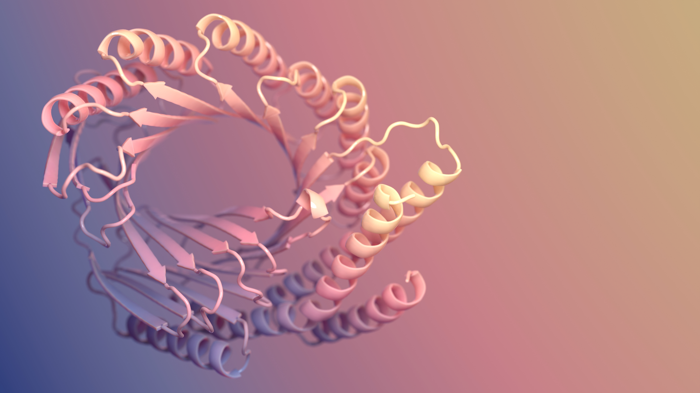
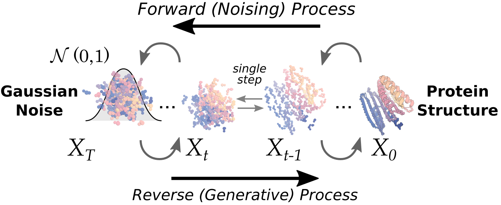
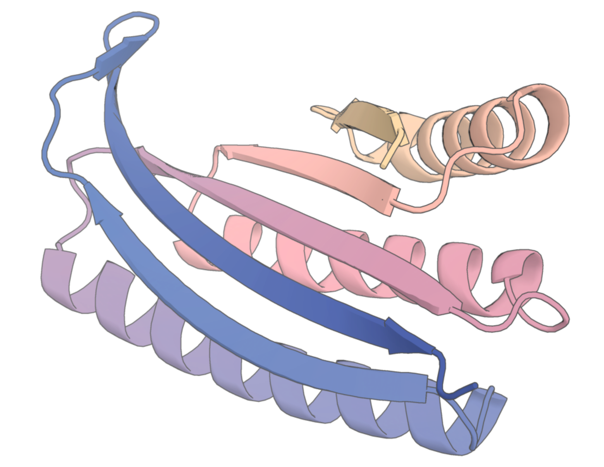
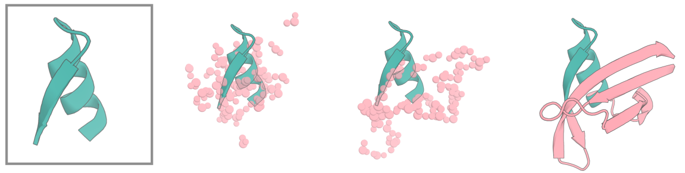
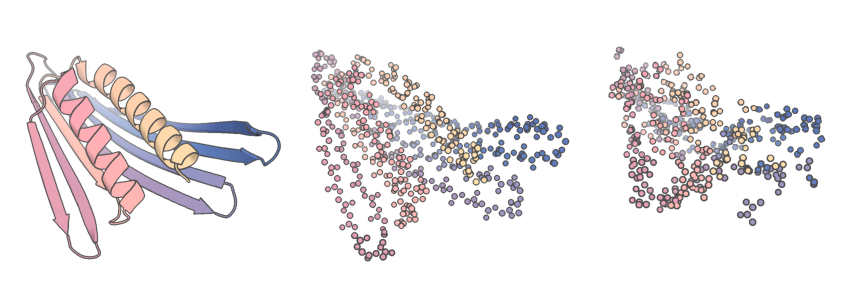
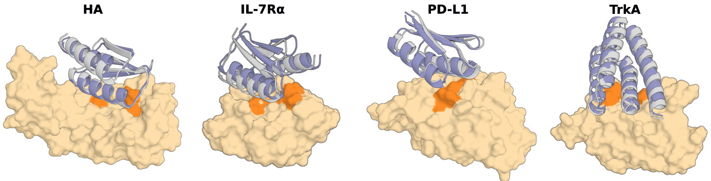
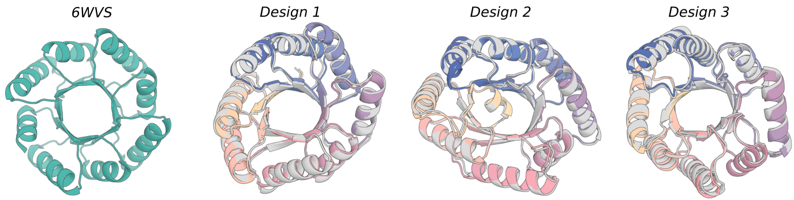
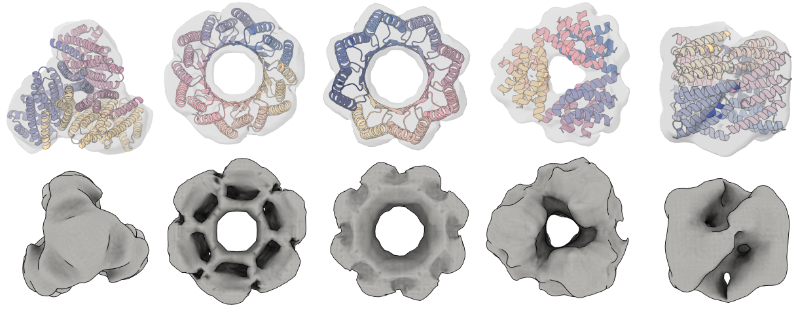
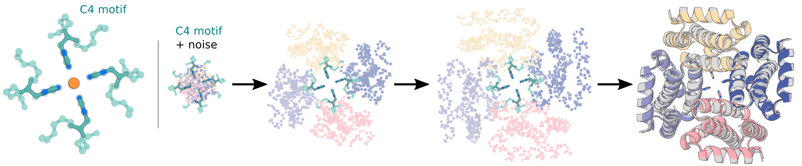

# RF*diffusion*

<!--

-->
<p align="center">
  
</p>

*Image: Ian C. Haydon / UW Institute for Protein Design*

## Description

RFdiffusion is an open source method for structure generation, with or without conditional information (a motif, target etc). It can perform a whole range of protein design challenges as we have outlined in [the RFdiffusion paper](https://www.biorxiv.org/content/10.1101/2022.12.09.519842v1).

**Things Diffusion can do**
- Motif Scaffolding
- Unconditional protein generation
- Symmetric unconditional generation (cyclic, dihedral and tetrahedral symmetries currently implemented, more coming!)
- Symmetric motif scaffolding
- Binder design
- Design diversification ("partial diffusion", sampling around a design)

----

# Table of contents

- [RF*diffusion*](#rfdiffusion)
  - [Description](#description)
- [Table of contents](#table-of-contents)
- [Getting started / installation](#getting-started--installation)
    - [Conda Install SE3-Transformer](#conda-install-se3-transformer)
    - [Get PPI Scaffold Examples](#get-ppi-scaffold-examples)
- [Usage](#usage)
    - [Running the diffusion script](#running-the-diffusion-script)
    - [Basic execution - an unconditional monomer](#basic-execution---an-unconditional-monomer)
    - [Motif Scaffolding](#motif-scaffolding)
    - [The "active site" model holds very small motifs in place](#the-active-site-model-holds-very-small-motifs-in-place)
    - [The `inpaint_seq` flag](#the-inpaint_seq-flag)
    - [A note on `diffuser.T`](#a-note-on-diffusert)
    - [Partial diffusion](#partial-diffusion)
    - [Binder Design](#binder-design)
    - [Practical Considerations for Binder Design](#practical-considerations-for-binder-design)
    - [Fold Conditioning](#fold-conditioning)
    - [Generation of Symmetric Oligomers](#generation-of-symmetric-oligomers)
    - [Using Auxiliary Potentials](#using-auxiliary-potentials)
    - [Symmetric Motif Scaffolding.](#symmetric-motif-scaffolding)
    - [A Note on Model Weights](#a-note-on-model-weights)
    - [Things you might want to play with at inference time](#things-you-might-want-to-play-with-at-inference-time)
    - [Understanding the output files](#understanding-the-output-files)
    - [Docker](#docker)
    - [Conclusion](#conclusion)

# Getting started / installation

Thanks to Sergey Ovchinnikov, RFdiffusion is available as a [Google Colab Notebook](https://colab.research.google.com/github/sokrypton/ColabDesign/blob/v1.1.1/rf/examples/diffusion.ipynb) if you would like to run it there!

We strongly recommend reading this README carefully before getting started with RFdiffusion, and working through some of the examples in the Colab Notebook.

If you want to set up RFdiffusion locally, follow the steps below:

To get started using RFdiffusion, clone the repo:
```
git clone https://github.com/RosettaCommons/RFdiffusion.git
```

You'll then need to download the model weights into the RFDiffusion directory.
```
cd RFdiffusion
mkdir models && cd models
wget http://files.ipd.uw.edu/pub/RFdiffusion/6f5902ac237024bdd0c176cb93063dc4/Base_ckpt.pt
wget http://files.ipd.uw.edu/pub/RFdiffusion/e29311f6f1bf1af907f9ef9f44b8328b/Complex_base_ckpt.pt
wget http://files.ipd.uw.edu/pub/RFdiffusion/60f09a193fb5e5ccdc4980417708dbab/Complex_Fold_base_ckpt.pt
wget http://files.ipd.uw.edu/pub/RFdiffusion/74f51cfb8b440f50d70878e05361d8f0/InpaintSeq_ckpt.pt
wget http://files.ipd.uw.edu/pub/RFdiffusion/76d00716416567174cdb7ca96e208296/InpaintSeq_Fold_ckpt.pt
wget http://files.ipd.uw.edu/pub/RFdiffusion/5532d2e1f3a4738decd58b19d633b3c3/ActiveSite_ckpt.pt
wget http://files.ipd.uw.edu/pub/RFdiffusion/12fc204edeae5b57713c5ad7dcb97d39/Base_epoch8_ckpt.pt

Optional:
wget http://files.ipd.uw.edu/pub/RFdiffusion/f572d396fae9206628714fb2ce00f72e/Complex_beta_ckpt.pt

# original structure prediction weights
wget http://files.ipd.uw.edu/pub/RFdiffusion/1befcb9b28e2f778f53d47f18b7597fa/RF_structure_prediction_weights.pt
```


### Conda Install SE3-Transformer

Ensure that you have either [Anaconda or Miniconda](https://conda.io/projects/conda/en/latest/user-guide/install/index.html) installed.

You also need to install [NVIDIA's implementation of SE(3)-Transformers](https://developer.nvidia.com/blog/accelerating-se3-transformers-training-using-an-nvidia-open-source-model-implementation/) Here is how to install the NVIDIA SE(3)-Transformer code:

```
conda env create -f env/SE3nv.yml

conda activate SE3nv
cd env/SE3Transformer
pip install --no-cache-dir -r requirements.txt
python setup.py install
cd ../.. # change into the root directory of the repository
pip install -e . # install the rfdiffusion module from the root of the repository
```
Anytime you run diffusion you should be sure to activate this conda environment by running the following command:
```
conda activate SE3nv
```
Total setup should take less than 30 minutes on a standard desktop computer.
Note: Due to the variation in GPU types and drivers that users have access to, we are not able to make one environment that will run on all setups. As such, we are only providing a yml file with support for CUDA 11.1 and leaving it to each user to customize it to work on their setups. This customization will involve changing the cudatoolkit and (possibly) the PyTorch version specified in the yml file.

---

### Get PPI Scaffold Examples

To run the scaffolded protein binder design (PPI) examples, we have provided some example scaffold files (`examples/ppi_scaffolds_subset.tar.gz`).
You'll need to untar this:
```
tar -xvf examples/ppi_scaffolds_subset.tar.gz -C examples/
```

We will explain what these files are and how to use them in the Fold Conditioning section.

----


# Usage
In this section we will demonstrate how to run diffusion.


<p align="center">
  
</p>


### Running the diffusion script
The actual script you will execute is called `scripts/run_inference.py`. There are many ways to run it, governed by hydra configs.
[Hydra configs](https://hydra.cc/docs/configure_hydra/intro/) are a nice way of being able to specify many different options, with sensible defaults drawn *directly* from the model checkpoint, so inference should always, by default, match training.
What this means is that the default values in `config/inference/base.yml` might not match the actual values used during inference, with a specific checkpoint. This is all handled under the hood.

---
### Basic execution - an unconditional monomer


Let's first look at how you would do unconditional design of a protein of length 150aa.
For this, we just need to specify three things:
1. The length of the protein
2. The location where we want to write files to
3. The number of designs we want

```
./scripts/run_inference.py 'contigmap.contigs=[150-150]' inference.output_prefix=test_outputs/test inference.num_designs=10
```

Let's look at this in detail.
Firstly, what is `contigmap.contigs`?
Hydra configs tell the inference script how it should be run. To keep things organised, the config has different sub-configs, one of them being `contigmap`, which pertains to everything related to the contig string (that defines the protein being built).
Take a look at the config file if this isn't clear: `configs/inference/base.yml`
Anything in the config can be overwritten manually from the command line. You could, for example, change how the diffuser works:
```
diffuser.crd_scale=0.5
```
... but don't do this unless you really know what you're doing!!


Now, what does `'contigmap.contigs=[150-150]'` mean?
To those who have used RFjoint inpainting, this might look familiar, but a little bit different. Diffusion, in fact, uses the identical 'contig mapper' as inpainting, except that, because we're using hydra, we have to give this to the model in a different way. The contig string has to be passed as a single-item in a list, rather than as a string, for hydra reasons and the entire argument MUST be enclosed in `''` so that the commandline does not attempt to parse any of the special characters.

The contig string allows you to specify a length range, but here, we just want a protein of 150aa in length, so you just specify [150-150]
This will then run 10 diffusion trajectories, saving the outputs to your specified output folder.

NB the first time you run RFdiffusion, it will take a while 'Calculating IGSO3'. Once it has done this, it'll be cached for future reference though! For an additional example of unconditional monomer generation, take a look at `./examples/design_unconditional.sh` in the repo! 

---
### Motif Scaffolding
<!--
<p align="center">
  
</p>
-->
RFdiffusion can be used to scaffold motifs, in a manner akin to [Constrained Hallucination and RFjoint Inpainting](https://www.science.org/doi/10.1126/science.abn2100#:~:text=The%20binding%20and%20catalytic%20functions%20of%20proteins%20are,the%20fold%20or%20secondary%20structure%20of%20the%20scaffold.). In general, RFdiffusion significantly outperforms both Constrained Hallucination and RFjoint Inpainting.
<p align="center">
  
</p>

When scaffolding protein motifs, we need a way of specifying that we want to scaffold some particular protein input (one or more segments from a `.pdb` file), and to be able to specify how we want these connected, and by how many residues, in the new scaffolded protein. What's more, we want to be able to sample different lengths of connecting protein, as we generally don't know *a priori* precisely how many residues we'll need to best scaffold a motif. This job of specifying inputs is handled by contigs, governed by the contigmap config in the hydra config. For those familiar with Constrained Hallucination or RFjoint Inpainting, the logic is very similar.
Briefly:
- Anything prefixed by a letter indicates that this is a motif, with the letter corresponding to the chain letter in the input pdb files. E.g. A10-25 pertains to residues ('A',10),('A',11)...('A',25) in the corresponding input pdb
- Anything not prefixed by a letter indicates protein *to be built*. This can be input as a length range. These length ranges are randomly sampled each iteration of RFdiffusion inference. 
- To specify chain breaks, we use `/0 `.

In more detail, if we want to scaffold a motif, the input is just like RFjoint Inpainting, except needing to navigate the hydra config input. If we want to scaffold residues 10-25 on chain A a pdb, this would be done with `'contigmap.contigs=[5-15/A10-25/30-40]'`. This asks RFdiffusion to build 5-15 residues (randomly sampled at each inference cycle) N-terminally of A10-25 from the input pdb, followed by 30-40 residues (again, randomly sampled) to its C-terminus. If we wanted to ensure the length was always e.g. 55 residues, this can be specified with `contigmap.length=55-55`. You need to obviously also provide a path to your pdb file: `inference.input_pdb=path/to/file.pdb`. It doesn't matter if your input pdb has residues you *don't* want to scaffold - the contig map defines which residues in the pdb are actually used as the "motif". In other words, even if your pdb files has a B chain, and other residues on the A chain, *only* A10-25 will be provided to RFdiffusion.

To specify that we want to inpaint in the presence of a separate chain, this can be done as follows:

```
'contigmap.contigs=[5-15/A10-25/30-40/0 B1-100]'
```
Look at this carefully. `/0 ` is the indicator that we want a chain break. NOTE, the space is important here. This tells the diffusion model to add a big residue jump (200aa) to the input, so that the model sees the first chain as being on a separate chain to the second.

An example of motif scaffolding can be found in `./examples/design_motifscaffolding.sh`.

### The "active site" model holds very small motifs in place
In the RFdiffusion preprint we noted that for very small motifs, RFdiffusion has the tendency to not keep them perfectly fixed in the output. Therefore, for scaffolding minimalist sites such as enzyme active sites, we fine-tuned RFdiffusion on examples similar to these tasks, allowing it to hold smaller motifs better in place, and better generate *in silico* successes. If your input functional motif is very small, we reccomend using this model, which can easily be specified using the following syntax: 
`inference.ckpt_override_path=models/ActiveSite_ckpt.pt`

### The `inpaint_seq` flag
For those familiar with RFjoint Inpainting, the contigmap.inpaint_seq input is equivalent. The idea is that often, when, for example, fusing two proteins, residues that were on the surface of a protein (and are therefore likely polar), now need to be packed into the 'core' of the protein. We therefore want them to become hydrophobic residues. What we can do, rather than directly mutating them to hydrophobics, is to mask their sequence identity, and allow RFdiffusion to implicitly reason over their sequence, and better pack against them. This requires a different model than the 'base' diffusion model, that has been trained to understand this paradigm, but this is automatically handled by the inference script (you don't need to do anything).

To specify amino acids whose sequence should be hidden, use the following syntax:
```
'contigmap.inpaint_seq=[A1/A30-40]'
```
Here, we're masking the residue identity of residue A1, and all residues between A30 and A40 (inclusive). 

An example of executing motif scaffolding with the `contigmap.inpaint_seq` flag is located in `./examples/design_motifscaffolding_inpaintseq.sh`

### A note on `diffuser.T`
RFdiffusion was originally trained with 200 discrete timesteps. However, recent improvements have allowed us to reduce the number of timesteps we need to use at inference time. In many cases, running with as few as approximately 20 steps provides outputs of equivalent *in silico* quality to running with 200 steps (providing a 10X speedup). The default is now set to 50 steps. Noting this is important for understanding the partial diffusion, described below. 

---
### Partial diffusion

Something we can do with diffusion is to partially noise and de-noise a structure, to get some diversity around a general fold. This can work really nicely (see [Vazquez-Torres et al., BioRxiv 2022](https://www.biorxiv.org/content/10.1101/2022.12.10.519862v4.abstract)).
This is specified by using the diffuser.parial_T input, and setting a timestep to 'noise' to. 
<p align="center">
  
</p>
More noise == more diversity. In Vazquez-Torres et al., 2022, we typically used `diffuser.partial_T` of approximately 80, but this was with respect to the 200 timesteps we were using. Now that the default `diffuser.T` is 50, you will need to adjust diffuser.partial_T accordingly. E.g. now that `diffuser.T=50`, the equivalent of 80 noising steps is `diffuser.partial_T=20`. We strongly recommend sampling different values for `partial_T` however, to find the best parameters for your specific problem.

When doing partial diffusion, because we are now diffusing from a known structure, this creates certain constraints. You can still use the contig input, but *this has to yield a contig string exactly the same length as the input protein*. E.g. if you have a binder:target complex, and you want to diversify the binder (length 100, chain A), you would need to input something like this:

```
'contigmap.contigs=[100-100/0 B1-150]' diffuser.partial_T=20
```
The reason for this is that, if your input protein was only 80 amino acids, but you've specified a desired length of 100, we don't know where to diffuse those extra 20 amino acids from, and hence, they will not lie in the distribution that RFdiffusion has learned to denoise from.

An example of partial diffusion can be found in `./examples/design_partialdiffusion.sh`! 

You can also keep parts of the sequence of the diffused chain fixed, if you want. An example of why you might want to do this is in the context of helical peptide binding. If you've threaded a helical peptide sequence onto an ideal helix, and now want to diversify the complex, allowing the helix to be predicted now not as an ideal helix, you might do something like:

```
'contigmap.contigs=[100-100/0 20-20]' 'contigmap.provide_seq=[100-119]' diffuser.partial_T=10
```
In this case, the 20aa chain is the helical peptide. The `contigmap.provide_seq` input is zero-indexed, and you can provide a range (so 100-119 is an inclusive range, unmasking the whole sequence of the peptide). Multiple sequence ranges can be provided separated by a comma, e.g. `'contigmap.provide_seq=[172-177,200-205]'`.

Note that the provide_seq option requires using a different model checkpoint, but this is automatically handled by the inference script.

An example of partial diffusion with providing sequence in diffused regions can be found in `./examples/design_partialdiffusion_withseq.sh`. The same example specifying multiple sequence ranges can be found in `./examples/design_partialdiffusion_multipleseq.sh`.

---
### Binder Design 
Hopefully, it's now obvious how you might make a binder with diffusion! Indeed, RFdiffusion shows excellent *in silico* and experimental ability to design *de novo* binders. 

<p align="center">
  
</p>

If chain B is your target, then you could do it like this:

```
./scripts/run_inference.py 'contigmap.contigs=[B1-100/0 100-100]' inference.output_prefix=test_outputs/binder_test inference.num_designs=10
```

This will generate 100 residue long binders to residues 1-100 of chain B.

However, this probably isn't the best way of making binders. Because diffusion is somewhat computationally-intensive, we need to try and make it as fast as possible. Providing the whole of your target, uncropped, is going to make diffusion very slow if your target is big (and most targets-of-interest, such as cell-surface receptors tend to be *very* big). One tried-and-true method to speed up binder design is to crop the target protein around the desired interface location. BUT! This creates a problem: if you crop your target and potentially expose hydrophobic core residues which were buried before the crop, how can you guarantee the binder will go to the intended interface site on the surface of the target, and not target the tantalizing hydrophobic patch you have just artificially created?

We solve this issue by providing the model with what we call "hotspot residues". The complex models we refer to earlier in this README file have all been trained with hotspot residues, in this training regime, during each example, the model is told (some of) the residues on the target protein which contact the target (i.e., resides that are part of the interface). The model readily learns that it should be making an interface which involved these hotspot residues. At inference time then, we can provide our own hotspot residues to define a region which the binder must contact. These are specified like this: `'ppi.hotspot_res=[A30,A33,A34]'`, where `A` is the chain ID in the input pdb file of the hotspot residue and the number is the residue index in the input pdb file of the hotspot residue.

Finally, it has been observed that the default RFdiffusion model often generates mostly helical binders. These have high computational and experimental success rates. However, there may be cases where other kinds of topologies may be desired. For this, we include a "beta" model, which generates a greater diversity of topologies, but has not been extensively experimentally validated. Try this at your own risk:

```
inference.ckpt_override_path=models/Complex_beta_ckpt.pt
```

An example of binder design with RFdiffusion can be found in `./examples/design_ppi.sh`.

---

## Practical Considerations for Binder Design

RFdiffusion is an extremely powerful binder design tool but it is not magic. In this section we will walk through some common pitfalls in RFdiffusion binder design and offer advice on how to get the most out of this method.

### Selecting a Target Site
Not every site on a target protein is a good candidate for binder design. For a site to be an attractive candidate for binding it should have >~3 hydrophobic residues for the binder to interact with. Binding to charged polar sites is still quite hard. Binding to sites with glycans close to them is also hard since they often become ordered upon binding and you will take an energetic hit for that. Historically, binder design has also avoided unstructured loops, it is not clear if this is still a requirement as RFdiffusion has been used to bind unstructured peptides which share a lot in common with unstructured loops.

### Truncating your Target Protein
RFdiffusion scales in runtime as O(N^2) where N is the number of residues in your system. As such, it is a very good idea to truncate large targets so that your computations are not unnecessarily	 expensive. RFdiffusion and all downstream steps (including AF2) are designed to allow for a truncated target. Truncating a target is an art. For some targets, such as multidomain extracellular membranes, a natural truncation point is where two domains are joined by a flexible linker. For other proteins, such as virus spike proteins, this truncation point is less obvious. Generally you want to preserve secondary structure and introduce as few chain breaks as possible. You should also try to leave ~10A of target protein on each side of your intended target site. We recommend using PyMol to truncate your target protein.

### Picking Hotspots
Hotspots are a feature that we integrated into the model to allow for the control of the site on the target which the binder will interact with. In the paper we define a hotspot as a residue on the target protein which is within 10A Cbeta distance of the binder. Of all of the hotspots which are identified on the target 0-20% of these hotspots are actually provided to the model and the rest are masked. This is important for understanding how you should pick hotspots at inference time.; the model is expecting to have to make more contacts than you specify. We normally recommend between 3-6 hotspots, you should run a few pilot runs before generating thousands of designs to make sure the number of hotspots you are providing will give results you like.

If you have run the previous PatchDock RifDock binder design pipeline, for the RFdiffusion paper we chose our hotspots to be the PatchDock residues of the target.

### Binder Design Scale
In the paper, we generated ~10,000 RFdiffusion binder backbones for each target. From this set of backbones we then generated two sequences per backbone using ProteinMPNN-FastRelax (described below). We screened these ~20,000 designs using AF2 with initial guess and target templating (also described below).

Given the high success rates we observed in the paper, for some targets it may be sufficient to only generate ~1,000 RFdiffusion backbones in a campaign. What you want is to get enough designs that pass pAE_interaction < 10 (described more in Binder Design Filtering section) such that you are able to fill a DNA order with these successful designs. We have found that designs that do not pass pAE_interaction < 10 are not worth ordering since they will likely not work experimentally.

### Sequence Design for Binders
You may have noticed that the binders designed by RFdiffusion come out with a poly-Glycine sequence. This is not a bug. RFdiffusion is a backbone-generation model and does not generate sequence for the designed region, therefore, another method must be used to assign a sequence to the binders. In the paper we use the ProteinMPNN-FastRelax protocol to do sequence design. We recommend that you do this as well.  The code for this protocol can be found in [this GitHub repo](https://github.com/nrbennet/dl_binder_design). While we did not find the FastRelax part of the protocol to yield the large in silico success rate improvements that it yielded with the RifDock-generated docks, it is still a good way to increase your number of shots-on-goal for each (computationally expensive) RFdiffusion backbone. If you would prefer to simply run ProteinMPNN on your binders without the FastRelax step, that will work fine but will be more computationally expensive.

### Binder Design Filtering
One of the most important parts of the binder design pipeline is a filtering step to evaluate if your binders are actually predicted to work. In the paper we filtered using AF2 with an initial guess and target templating, scripts for this protocol are available [here](https://github.com/nrbennet/dl_binder_design). We have found that filtering at pae_interaction < 10 is a good predictor of a binder working experimentally.

---

### Fold Conditioning 
Something that works really well is conditioning binder design (or monomer generation) on particular topologies. This is achieved by providing (partial) secondary structure and block adjacency information (to a model that has been trained to condition on this). 
<p align="center">
  
</p>
We are still working out the best way to actually generate this input at inference time, but for now, we have settled upon generating inputs directly from pdb structures. This permits 'low resolution' specification of output topology (i.e., I want a TIM barrel but I don't care precisely where resides are). In `helper_scripts/`, there's a script called `make_secstruc_adj.py`, which can be used as follows:

e.g. 1:
```
./make_secstruc_adj.py --input_pdb ./2KL8.pdb --out_dir /my/dir/for/adj_secstruct
```
or e.g. 2:
```
./make_secstruc_adj.py --pdb_dir ./pdbs/ --out_dir /my/dir/for/adj_secstruct
```

This will process either a single pdb, or a folder of pdbs, and output a secondary structure and adjacency pytorch file, ready to go into the model. For now (although this might not be necessary), you should also generate these files for the target protein (if you're doing PPI), and provide this to the model. You can then use these at inference as follows:

```
./scripts/run_inference.py inference.output_prefix=./scaffold_conditioned_test/test scaffoldguided.scaffoldguided=True scaffoldguided.target_pdb=False scaffoldguided.scaffold_dir=./examples/ppi_scaffolds_subset
```

A few extra things:
1) As mentioned above, for PPI, you will want to provide a target protein, along with its secondary structure and block adjacency. This can be done by adding:

```
scaffoldguided.target_pdb=True scaffoldguided.target_path=input_pdbs/insulin_target.pdb inference.output_prefix=insulin_binder/jordi_ss_insulin_noise0_job0 'ppi.hotspot_res=[A59,A83,A91]' scaffoldguided.target_ss=target_folds/insulin_target_ss.pt scaffoldguided.target_adj=target_folds/insulin_target_adj.pt
```

To generate these block adjacency and secondary structure inputs, you can use the helper script.

This will now generate 3-helix bundles to the insulin target. 

For ppi, it's probably also worth adding this flag:

```
scaffoldguided.mask_loops=False
```

This is quite important to understand. During training, we mask some of the secondary structure and block adjacency. This is convenient, because it allows us to, at inference, easily add extra residues without having to specify precise secondary structure for every residue. E.g. if you want to make a long 3 helix bundle, you could mask the loops, and add e.g. 20 more 'mask' tokens to that loop. The model will then (presumbly) choose to make e.g. 15 of these residues into helices (to extend the 3HB), and then make a 5aa loop. But, you didn't have to specify that, which is nice. The way this would be done would be like this:

```
scaffoldguided.mask_loops=True scaffoldguided.sampled_insertion=15 scaffoldguided.sampled_N=5 scaffoldguided.sampled_C=5
```

This will, at each run of inference, sample up to 15 residues to insert into loops in your 3HB input, and up to 5 additional residues at N and C terminus.
This strategy is very useful if you don't have a large set of pdbs to make block adjacencies for. For example, we showed that we could generate loads of lengthened TIM barrels from a single starting pdb with this strategy. However, for PPI, if you're using the provided scaffold sets, it shouldn't be necessary (because there are so many scaffolds to start from, generating extra diversity isn't especially necessary).

Finally, if you have a big directory of block adjacency/secondary structure files, but don't want to use all of them, you can make a `.txt` file of the ones you want to use, and pass:

```
scaffoldguided.scaffold_list=path/to/list
```

For PPI, we've consistently seen that reducing the noise added at inference improves designs. This comes at the expense of diversity, but, given that the scaffold sets are huge, this probably doesn't matter too much. We therefore recommend lowering the noise. 0.5 is probably a good compromise:

```
denoiser.noise_scale_ca=0.5 denoiser.noise_scale_frame=0.5
```
This just scales the amount of noise we add to the translations (`noise_scale_ca`) and rotations (`noise_scale_frame`) by, in this case, 0.5.

An additional example of PPI with fold conditioning is available here: `./examples/design_ppi_scaffolded.sh`

---

### Generation of Symmetric Oligomers 
We're going to switch gears from discussing PPI and look at another task at which RFdiffusion performs well on: symmetric oligomer design. This is done by symmetrising the noise we sample at t=T, and symmetrising the input at every timestep. We have currently implemented the following for use (with the others coming soon!):
- Cyclic symmetry
- Dihedral symmetry
- Tetrahedral symmetry

<p align="center">
  
</p>

Here's an example:
```
./scripts/run_inference.py --config-name symmetry  inference.symmetry=tetrahedral 'contigmap.contigs=[360]' inference.output_prefix=test_sample/tetrahedral inference.num_designs=1
```

Here, we've specified a different `config` file (with `--config-name symmetry`). Because symmetric diffusion is quite different from the diffusion described above, we packaged a whole load of symmetry-related configs into a new file (see `configs/inference/symmetry.yml`). Using this config file now puts diffusion in `symmetry-mode`.

The symmetry type is then specified with `inference.symmetry=`. Here, we're specifying tetrahedral symmetry, but you could also choose cyclic (e.g. `c4`) or dihedral (e.g. `d2`).

The configmap.contigs length refers to the *total* length of your oligomer. Therefore, it *must* be divisible by *n* chains.

More examples of designing oligomers can be found here: `./examples/design_cyclic_oligos.sh`, `./examples/design_dihedral_oligos.sh`, `./examples/design_tetrahedral_oligos.sh`.

---

### Using Auxiliary Potentials 
Performing diffusion with symmetrized noise may give you the idea that we could use other external interventions during the denoising process to guide diffusion. One such intervention that we have implemented is auxiliary potentials. Auxiliary potentials can be very useful for guiding the inference process. E.g. whereas in RFjoint inpainting, we have little/no control over the final shape of an output, in diffusion we can readily force the network to make, for example, a well-packed protein.
This is achieved in the updates we make at each step.

Let's go a little deeper into how the diffusion process works:
At timestep T (the first step of the reverse-diffusion inference process), we sample noise from a known *prior* distribution. The model then makes a prediction of what the final structure should be, and we use these two states (noise at time T, prediction of the structure at time 0) to back-calculate where t=T-1 would have been. We therefore have a vector pointing from each coordinate at time T, to their corresponding, back-calculated position at time T-1.
But, we want to be able to bias this update, to *push* the trajectory towards some desired state. This can be done by biasing that vector with another vector, which points towards a position where that residue would *reduce* the 'loss' as defined by your potential. E.g. if we want to use the `monomer_ROG` potential, which seeks to minimise the radius of gyration of the final protein, if the models prediction of t=0 is very elongated, each of those distant residues will have a larger gradient when we differentiate the `monomer_ROG` potential w.r.t. their positions. These gradients, along with the corresponding scale, can be combined into a vector, which is then combined with the original update vector to make a "biased update" at that timestep.

The exact parameters used when applying these potentials matter. If you weight them too strongly, you're not going to end up with a good protein. Too weak, and they'll have little effect. We've explored these potentials in a few different scenarios, and have set sensible defaults, if you want to use them. But, if you feel like they're too weak/strong, or you just fancy exploring, do play with the parameters (in the `potentials` part of the config file).

Potentials are specified as a list of strings with each string corresponding to a potential. The argument for potentials is `potentials.guiding_potentials`. Within the string per-potential arguments may be specified in the following syntax: `arg_name1:arg_value1,arg_name2:arg_value2,...,arg_nameN:arg_valueN`. The only argument that is required for each potential is the name of the potential that you wish to apply, the name of this argument is `type` as-in the type of potential you wish to use. Some potentials such as `olig_contacts` and `substrate_contacts` take global options such as `potentials.substrate`, see `config/inference/base.yml` for all the global arguments associated with potentials. Additionally, it is useful to have the effect of the potential "decay" throughout the trajectory, such that in the beginning the effect of the potential is 1x strength, and by the end is much weaker. These decays (`constant`,`linear`,`quadratic`,`cubic`) can be set with the `potentials.guide_decay` argument. 

Here's an example of how to specify a potential:

```
potentials.guiding_potentials=[\"type:olig_contacts,weight_intra:1,weight_inter:0.1\"] potentials.olig_intra_all=True potentials.olig_inter_all=True potentials.guide_scale=2 potentials.guide_decay='quadratic'
```

We are still fully characterising how/when to use potentials, and we strongly recommend exploring different parameters yourself, as they are clearly somewhat case-dependent. So far, it is clear that they can be helpful for motif scaffolding and symmetric oligomer generation. However, they seem to interact weirdly with hotspot residues in PPI. We think we know why this is, and will work in the coming months to write better potentials for PPI. And please note, it is often good practice to start with *no potentials* as a baseline, then slowly increase their strength. For the oligomer contacts potentials, start with the ones provided in the examples, and note that the `intra` chain potential often should be higher than the `inter` chain potential.

We have already implemented several potentials but it is relatively straightforward to add more, if you want to push your designs towards some specified goal. The *only* condition is that, whatever potential you write, it is differentiable. Take a look at `potentials.potentials.py` for examples of the potentials we have implemented so far. 

---

### Symmetric Motif Scaffolding.  
We can also combine symmetric diffusion with motif scaffolding to scaffold motifs symmetrically.
Currently, we have one way for performing symmetric motif scaffolding. That is by specifying the position of the motif specified w.r.t. the symmetry axes.  

<p align="center">
  
</p>

**Special input .pdb and contigs requirements**

For now, we require that a user have a symmetrized version of their motif in their input pdb for symmetric motif scaffolding. There are two main reasons for this. First, the model is trained by centering any motif at the origin, and thus the code also centers motifs at the origin automatically. Therefore, if your motif is not symmetrized, this centering action will result in an asymmetric unit that now has the origin and axes of symmetry running right through it (bad). Secondly, the diffusion code uses a canonical set of symmetry axes (rotation matrices) to propogate the asymmetric unit of a motif. In order to prevent accidentally running diffusion trajectories which are propogating your motif in ways you don't intend, we require that a user symmetrize an input using the RFdiffusion canonical symmetry axes.

**RFdiffusion canonical symmetry axes** 
| Group      |      Axis     | 
|:----------:|:-------------:|
| Cyclic     |  Z |
| Dihedral (cyclic) |    Z   |
| Dihedral (flip/reflection) | X |


**Example: Inputs for symmetric motif scaffolding with motif position specified w.r.t the symmetry axes.**

This example script `examples/design_nickel.sh` can be used to scaffold the C4 symmetric Nickel binding domains shown in the RFdiffusion paper. It combines many concepts discussed earlier, including symmetric oligomer generation, motif scaffolding, and use of guiding potentials.

Note that the contigs should specify something that is precisely symmetric. Things will break if this is not the case. 

---

### A Note on Model Weights

Because of everything we want diffusion to be able to do, there is not *One Model To Rule Them All*. E.g., if you want to run with secondary structure conditioning, this requires a different model than if you don't. Under the hood, we take care of most of this by default - we parse your input and work out the most appropriate checkpoint.
This is where the config setup is really useful. The exact model checkpoint used at inference contains in it all of the parameters is was trained with, so we can just populate the config file with those values, such that inference runs as designed.
If you do want to specify a different checkpoint (if, for example, we train a new model and you want to test it), you just have to make sure it's compatible with what you're doing. E.g. if you try and give secondary structure features to a model that wasn't trained with them, it'll crash.

### Things you might want to play with at inference time

Occasionally, it might good to try an alternative model (for example the active site model, or the beta binder model). These can be specified with `inference.ckpt_override_path`. We do not recommend using these outside of the described use cases, however, as there is not a guarantee they will understand other kinds of inputs.

For a full list of things that are implemented at inference, see the config file (`configs/inference/base.yml` or `configs/inference/symmetry.yml`). Although you can modify everything, this is not recommended unless you know what you're doing.
Generally, don't change the `model`, `preprocess` or `diffuser` configs. These pertain to how the model was trained, so it's unwise to change how you use the model at inference time.
However, the parameters below are definitely worth exploring:
-inference.final_step: This is when we stop the trajectory. We have seen that you can stop early, and the model is already making a good prediction of the final structure. This speeds up inference.
-denoiser.noise_scale_ca and denoiser.noise_scale_frame: These can be used to reduce the noise used during sampling (as discussed for PPI above). The default is 1 (the same noise added at training), but this can be reduced to e.g. 0.5, or even 0. This actually improves the quality of models coming out of diffusion, but at the expense of diversity. If you're not getting any good outputs, or if your problem is very constrained, you could try reducing the noise. While these parameters can be changed independently (for translations and rotations), we recommend keeping them tied.

### Understanding the output files
We output several different files.
1. The `.pdb` file. This is the final prediction out of the model. Note that every designed residue is output as a glycine (as we only designed the backbone), and no sidechains are output. This is because, even though RFdiffusion conditions on sidechains in an input motif, there is no loss applied to these predictions, so they can't strictly be trusted.
2. The `.trb` file. This contains useful metadata associated with that specific run, including the specific contig used (if length ranges were sampled), as well as the full config used by RFdiffusion. There are also a few other convenient items in this file:
    - details about mapping (i.e. how residues in the input map to residues in the output)
        - `con_ref_pdb_idx`/`con_hal_pdb_idx` - These are two arrays including the input pdb indices (in con_ref_pdb_idx), and where they are in the output pdb (in con_hal_pdb_idx). This only contains the chains where inpainting took place (i.e. not any fixed receptor/target chains)
        - `con_ref_idx0`/`con_hal_idx0` - These are the same as above, but 0 indexed, and without chain information. This is useful for splicing coordinates out (to assess alignment etc).
        - `inpaint_seq` - This details any residues that were masked during inference.
3. Trajectory files. By default, we output the full trajectories into the `/traj/` folder. These files can be opened in pymol, as multi-step pdbs. Note that these are ordered in reverse, so the first pdb is technically the last (t=1) prediction made by RFdiffusion during inference. We include both the `pX0` predictions (what the model predicted at each timestep) and the `Xt-1` trajectories (what went into the model at each timestep).

### Docker

We have provided a Dockerfile at `docker/Dockerfile` to help run RFDiffusion on HPC and other container orchestration systems. Follow these steps to build and run the container on your system:

1. Clone this repository with `git clone https://github.com/RosettaCommons/RFdiffusion.git` and then `cd RFdiffusion`
1. Verify that the Docker daemon is running on your system with `docker info`. You can find Docker installation instructions for Mac, WIndows, and Linux in the [official Docker docs](https://docs.docker.com/get-docker/). You may also consider [Finch](https://github.com/runfinch/finch), the open source client for container development.
1. Build the container image on your system with `docker build -f docker/Dockerfile -t rfdiffusion .`
1. Create some folders on your file system with `mkdir $HOME/inputs $HOME/outputs $HOME/models`
1. Download the RFDiffusion models with `bash scripts/download_models.sh $HOME/models`
1. Download a test file (or another of your choice) with `wget -P $HOME/inputs https://files.rcsb.org/view/5TPN.pdb`
1. Run the container with the following command:

```bash
docker run -it --rm --gpus all \
  -v $HOME/models:$HOME/models \
  -v $HOME/inputs:$HOME/inputs \
  -v $HOME/outputs:$HOME/outputs \
  rfdiffusion \
  inference.output_prefix=$HOME/outputs/motifscaffolding \
  inference.model_directory_path=$HOME/models \
  inference.input_pdb=$HOME/inputs/5TPN.pdb \
  inference.num_designs=3 \
  'contigmap.contigs=[10-40/A163-181/10-40]'
```

  This starts the `rfdiffusion` container, mounts the models, inputs, and outputs folders, passes all available GPUs, and then calls the `run_inference.py` script with the parameters specified.

### Conclusion

We are extremely excited to share RFdiffusion with the wider scientific community. We expect to push some updates as and when we make sizeable improvements in the coming months, so do stay tuned. We realize it may take some time to get used to executing RFdiffusion with perfect syntax (sometimes Hydra is hard), so please don't hesitate to create GitHub issues if you need help, we will respond as often as we can. 

Now, let's go make some proteins. Have fun! 

\- Joe, David, Nate, Brian, Jason, and the RFdiffusion team. 

---

RFdiffusion builds directly on the architecture and trained parameters of RoseTTAFold. We therefore thank Frank DiMaio and Minkyung Baek, who developed RoseTTAFold.
RFdiffusion is released under an open source BSD License (see LICENSE file). It is free for both non-profit and for-profit use. 


